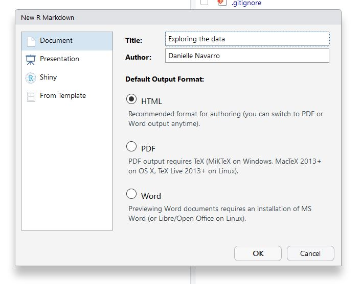
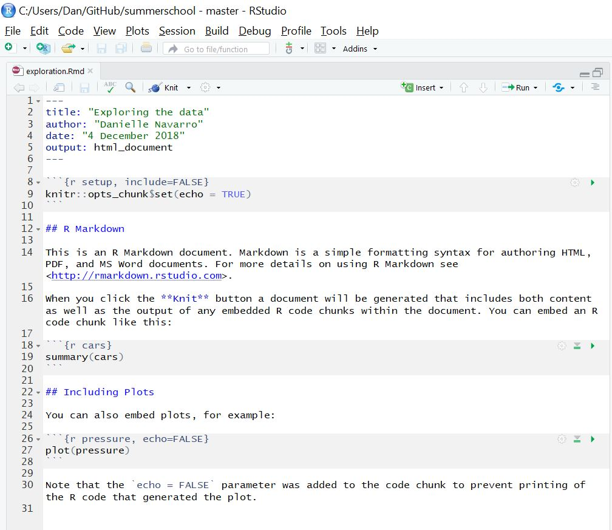

```{r setup, include=FALSE}
knitr::opts_chunk$set(echo = TRUE)
```

## Why care about project organization? 

Project organization is unglamorous but *extremely* important. Organizing your project files well from the start will make life much easier for you and anyone else who might be collaborating on the project. Many times in my life I've come back to a project that I previously looked at weeks, months or years ago, and had a very difficult time figuring out what I was doing and where I'd put critical files. A lot of this pain could have been avoided by following the suggestions in this notebook! 

## Starting a new project

Let's say that you're about to start a project on memory for pitch, and you'd like to create a new repository called `pitchmemory`.
Danielle Navarro has created a template that you can use to initialize your new repository. Go to [https://github.com/djnavarro/newproject/](https://github.com/djnavarro/newproject/) and click on the green button labelled "Use this template":


A window will come up allowing you to name the new repository -- call it `pitchmemory`. Now navigate into your 
 `Desktop/CHDSS` folder and clone the repository. I'd type
 ```
> git clone  https://github.com/cskemp/pitchmemory.git
```


## Folder structure
If you open up the `pitchmemory` folder you'll see something like:


Each folder includes a README, so poking around and reading them will give you a sense of the intended purpose of each folder. Here we'll give a high-level overview.

### experiments
If this is an experimental project, the `experiments` folder will contain a sub-folder for each experiment. These sub-folders include source code for the experiment (if it is computerized) and raw data.

### preprocessing
 Scripts for cleaning the data are in `preprocessing` --- these scripts read from the raw data files in `experiments` and write to `data`. You should never edit the raw data files manually---all preprocessing (e.g. dropping incomplete records) should be done by scripts which allows others to reproduce exactly what you did.

### data
The `data` folder includes cleaned data files only. 

### analysis
Scripts for analyzing the cleaned data and running statistical tests go in the `analysis` folder. 

### model
If the project includes one or more computational models, they go in the `model` folder.

### writeup
The `writeup` folder includes talks, posters and manuscripts that describe the project.

### docs

The "docs" folder on GitHub is special: if your project is set up to allow it, any files in this folder will appear as a GitHub Pages website. We therefore suggest reserving this folder in case you'd like to put the project on the web at some stage, and placing project-related documents in other directories (e.g. `writeup`)


## Other organisation ideas

The `newproject` template is a good starting point but it's worth thinking about how you could add additional structure for your own projects. For example,

- The `experiments` folder could contain a subfolder called `ethics` that includes IRB applications and approvals.
- In the `analysis` and `model` folders, I like to have subfolders called `code` and `output`. Code and scripts go in `code`, and outputs (e.g. figures and data files containing results) go in `output`. If the `output` directory were deleted it should be possible to regenerate the entire thing automatically --- so don't edit your figures and other outputs by hand.
- You might consider having a `readings` folder where you keep articles you've read that are relevant to your project.

For more thoughts about project organisation, see this [guide to reproducible code]( https://www.britishecologicalsociety.org/wp-content/uploads/2017/12/guide-to-reproducible-code.pdf).


## File names

File names matter, and should be easily readable by both humans and machines. For human readability, 

- choose names that suggest what the file contains (e.g. `pitchnaming_analysis.R` is better than `pa.R`)
- choose names that link outputs (e.g. figures) with the file that produced them (e.g. `pitchnaming_analysis_scatterplots.svg` might be produced by (`pitchnaming_analysis.R`)

For machine readability.

- Avoid spaces, punctuation, accented characters and case sensitivity
-  Use delimiters to separate important information so that it can be easily recovered by a program (e.g. `data_pitchnaming_speeded.csv` and `data_pitchnaming_control.csv` might be good names if you had data for two conditions (speeded and control) in separate files)


## Making your repository public

Some people make their project repositories public from the very beginning --- this approach is consistent with the philosophy behind  [born-open data](https://link.springer.com/article/10.3758/s13428-015-0630-z).

In my group we normally start with a private repository, but aim to make the repository public when a project is submitted or accepted. If you follow this approach it's important to remember that GitHub keeps a record of all the changes you've made along the way as you work on your repository. This is a feature not a bug! It means that you can easily go back to previous versions of your files if you realise that you've deleted something that you need. But it does mean that you should be careful about what goes into the repository. For example, suppose that you add a data file to the repository that includes personal information about your participants. Before making the repository public, you scrub the data file and remove all identifying information. Once the repository is public, however, people will be able to recover the original version of the data file from the time when the repository was private.

## RStudio projects

The folder for the `pitchmemory` project is now well on the way, and normally you will also have folders for several other projects that you work on from time to time. It's useful to turn each of these projects into an [RStudio project](https://support.rstudio.com/hc/en-us/articles/200526207-Using-Projects). According to the developers, these RStudio projects

> make it straightforward to divide your work into multiple contexts, each with their own working directory, workspace, history, and source documents

Normally, R keeps track of various different events that have happened in your previous work, but it has no idea which events are associated with which "project". An RStudio project creates a `.Rproj` file that links the different scripts, data sets, etc within a particular folder on your computer. 
So, why work in projects? As I see it, there are two kinds of reason, both of which are valid:

- *Convenience*. By working in projects, RStudio will help you keep things tidy, and it smooths the process in many ways.
- *Functionality.* The fact that RStudio projects leave a `.Rproj` file located at the "root" of your project serves as a useful anchor for other packages. For instance, there are packages (e.g., the `here` package) that can detect the `.Rproj` file and allow you to define the location of files relative to the project root. This is 
*incredibly* useful when sharing your code with other people!

### Creating a project 

The `pitchstudio` folder already has a file called `newproject.Rproj` that came from Dani's template. Rename this file to `pitchmemory.Rproj` to match the name of your repository. 

To see how to create a RStudio project from scratch, let's add one to the `summerschool` repository you created when learning about Git. Go to the the little blue menu in the top the top right corner in RStudio, click on the dropdown menu, and select "New Project".


This will bring up a dialog box that provides a few different optons. Because we're going to work in the existing folder that we created for the git tutorial (`~\Desktop\CHDSS\summerschool`), select "existing directory" and then browse for the correct location. 


Once you've created the project, if you have a look at the folder in Windows Explorer / Mac Finder, you'll see a new file called `summerschool.Rproj`:


Done. You now have an RStudio project. Any time you want to switch between projects, use the drop down menu. RStudio will automatically change the working directory, start a new R session for you, and open up whatever files you had open last time you were using it. 


## R Markdown documents

Documentation is often written using *markdown* --- for example, you used markdown earlier today when writing the README for your `summerschool` repository. R Markdown allows you to combine documentation and code in a way that is extremely convenient. 

Let's create a R Markdown document in your `summerschool` repository. First switch to the `summerschool` project in RStudio if you are not there already. Then use the Rstudio file menu to create a new R Markdown document:


Give your document a title and choose output type, which we'll assume to be HTML. 



This creates an untitled R Markdown document in the source pane:


Save it in your `summerschool` repository with the name `exploration.Rmd`. So now you have this:



Render your R Markdown document by clicking the `Knit` button. The result is an .html file that can be seen in the Viewer pane on the right side of RStudio.


### Structure of an R Markdown document

- the bit at the top is the "yaml header" (ignore it for now)
- anything shaded in grey (between the backticks) is a *code chunk* and is treated just like an R script
- anything in white treated like Markdown. 

Play around with this for a bit, and get a feel for how it works!

## When to use R Markdown documents

R Markdown can be used for many purposes, and we give only a handful of examples here.

- R Markdown is a good choice for preprocessing and analyzing data, and the `preprocessing` and `analysis` folders in our recommended structure will often contain R Markdown files. In both cases it is useful to combine code with comments that explain and motivate preprocessing steps, and that interpret and discuss the results of statistical analyses.

- Most of the summer school tutorials were created in R Markdown. For example, you can find the source of this tutorial in 
`CHDSS/chdss2019_content/day1/tutorials/project_organisation.Rmd`

- You can make slides in R Markdown. Try creating a new R Markdown file from the RStudio file menu and choosing the "Presentation" option

 - You can write journal papers in R Markdown! One example is in   `CHDSS/chdss2019_content/samplingframes/writeup/samplingframes.Rmd`   To Knit it (which creates a pdf in this case), you'll need to install the papaja package as described [here.](https://github.com/crsh/papaja)
 

## Resources

- [Guide to reproducible code]( https://www.britishecologicalsociety.org/wp-content/uploads/2017/12/guide-to-reproducible-code.pdf) put  together by a team of ecologists
- [Code and data for the social sciences](https://web.stanford.edu/~gentzkow/research/CodeAndData.xhtml)


