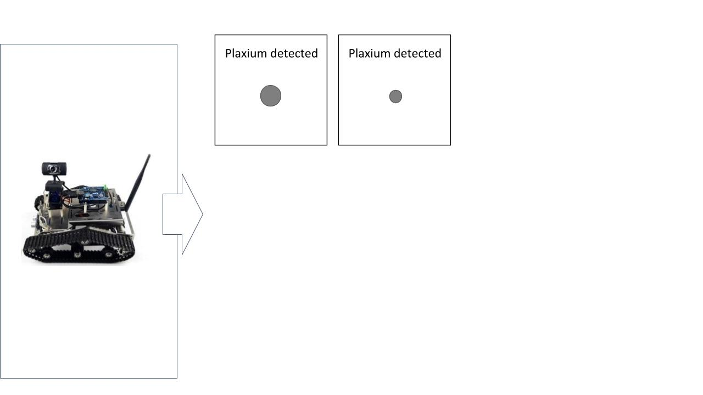
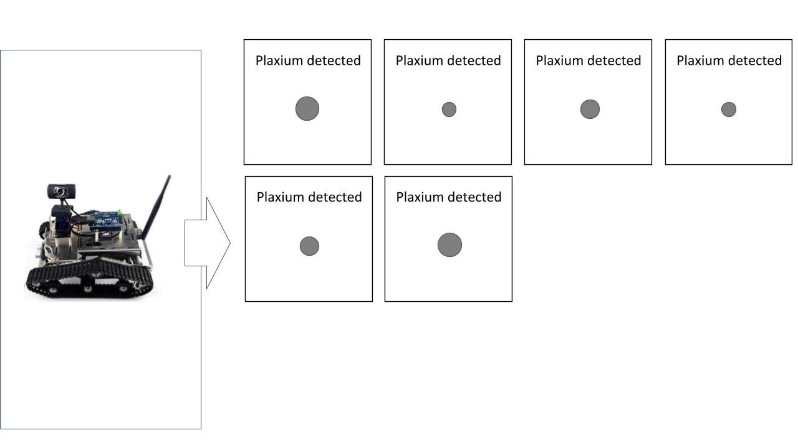
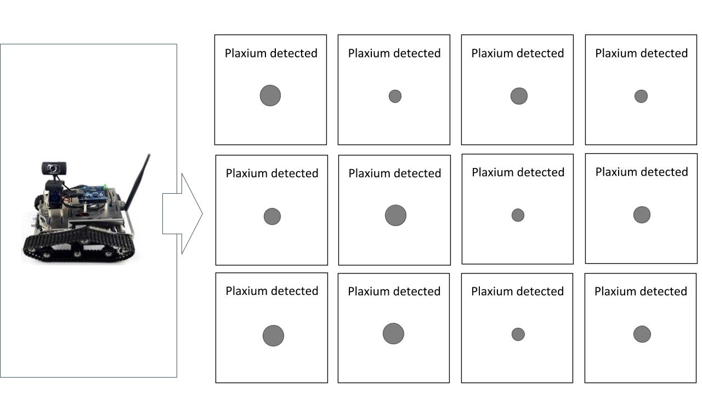

```{r setup, include=FALSE, message = FALSE}
options(htmltools.dir.version = FALSE)
library(here)
library(tidyverse)
library(skimr)
frames <- read_csv(here("data","frames_ex2.csv"))
```


class: bg-main1 center middle hide-slide-number

.reveal-text.bg-main2[.pad1[
.font4[Data wrangling]
]]


<!-- *********** NEW SLIDE ************** -->
---
class: split-two bg-main1

.column.bg-main1[.content.vmiddle.center[

# Data wrangling

<br>

.pull.left[.pad1[

### .orange[**What?**] 
### .orange[**Why?**] 
### .orange[**How?**] 

]]

]]

--
.column.bg-main3[.content.vmiddle.center[


[@allison_horst](https://twitter.com/allison_horst)

]]


<!-- *********** NEW SLIDE ************** -->
---
class: split-two bg-main1

.column.bg-main1[.content.vmiddle.center[

# Structure of this section

<br>

.pull.left[.pad1[

### This is interactive: don't just listen, code!
### Goal is to deal with real data

]]

]]

.column.bg-main3[.content.vmiddle.center[


[@allison_horst](https://twitter.com/allison_horst)


]]


<!-- *********** NEW SLIDE ************** -->
---

class: bg-main1 center middle hide-slide-number

.reveal-text.bg-main2[.pad1[
.font5[The "sampling<BR> frames"<BR> experiment]
]]


<!-- *********** NEW SLIDE ************** -->
---

class: bg-main1 center middle

# Property sampling: the robot only detects plaxium spheres
<br>

<br>


<!-- *********** NEW SLIDE ************** -->
---

class: bg-main1 center middle

# Category sampling: the robot only tests small spheres
<br>

<br>


<!-- *********** NEW SLIDE ************** -->
---

class: bg-main1 center middle

# Small sample size: Elicit judgments after two observations
<br>

<br>

<!-- *********** NEW SLIDE ************** -->
---

class: bg-main1 center middle

# Medium sample size: Elicit judgments after six observations
<br>

<br>

<!-- *********** NEW SLIDE ************** -->
---

class: bg-main1 center middle

# Large sample size: Elicit judgments after twelve observations
<br>

<br>


<!-- *********** NEW SLIDE ************** -->
---

class: bg-main1 center middle

# Seven test items that vary in size: Smallest...
<br>

<br>

<!-- *********** NEW SLIDE ************** -->
---

class: bg-main1 center middle

# Seven test items that vary in size: Largest...
<br>

<br>


<!-- *********** NEW SLIDE ************** -->
---
class: split-60 bg-main1

.column.bg-main1[.content.vmiddle.center[

# First let's pull all of the content for today

<br>

.pull.left[.pad1[

### Go to your chdss2019_content folder and type "git status"
### If you're not up to date, type "git pull"
<br>

### .white[Then copy the day3 folder to your CHDSS directory:]
### .white[Change directory to CHDSS/day3/]
### .white[You should see a file called data/frames_ex2.csv]

]]

]]

.column.bg-main3[.content.vmiddle.center[


]]


<!-- *********** NEW SLIDE ************** -->
---
class: split-60 bg-main1

.column.bg-main1[.content.vmiddle.center[

# First let's pull all of the content for today

<br>

.pull.left[.pad1[

### Go to your chdss2019_content folder and type "git status"
### If you're not up to date, type "git pull"
<br>

### Then copy the day3 folder to your CHDSS directory:
### Change directory to CHDSS/day3/
### You should see a file called data/frames_ex2.csv

]]

]]

.column.bg-main3[.content.vmiddle.center[


]]


<!-- *********** NEW SLIDE ************** -->
---

class: bg-main1 center middle hide-slide-number

.reveal-text.bg-main2[.pad1[
.font4[Getting started]
]]


<!-- *********** NEW SLIDE ************** -->
---
class: split-two bg-main1

.column.bg-main1[.content.vmiddle.center[

# If you don't have the packages...


.pull.left[.pad1[

```{r, eval=FALSE}
install.packages("tidyverse")
install.packages("skimr")
```


]]

]]

.column.bg-main3[.content.vmiddle.center[


]]

<!-- *********** NEW SLIDE ************** -->
---
class: split-40 bg-main1

.column.bg-main1[.content.vmiddle.center[

# New R Markdown

.pull.left[.pad1[.font2[
- Create and call it initial.Rmd
- At the top is the YAML header
- This is the whole document...
]]]

]]

.column.bg-main3[.content.vmiddle.center[

.pull.left[.pad1[.font2[

````
---
title: "Exploring the data"
author: Amy Perfors
date: 18 December 2019
output: html_document
---

```{r setup, include=FALSE}`r ''`
knitr::opts_chunk$set(echo = TRUE)
```
````

]]]
]]


<!-- *********** NEW SLIDE ************** -->
---
class: split-40 bg-main1

.column.bg-main1[.content.vmiddle.center[

# Write...

.pull.left[.pad1[.font2[
- Load packages in the first chunk
- Write descriptions for humans!
- Document, document, document
]]]

]]

.column.bg-main3[.content.vmiddle.center[

.pull.left[.pad1[.font2[

````
## Getting started

The first thing to do in our analysis is load the R
packages that we'll use to do the work:

```{r}`r ''`
library(here)
library(tidyverse)
library(skimr)
```

The next step is to load the data set itself. The data 
from the sampling frames experiment are stored in the 
"frames_ex2.csv" file:

```{r}`r ''`
loc <- here("data","frames_ex2.csv")
frames <- read_csv(file = loc)
```
````

]]]
]]


<!-- *********** NEW SLIDE ************** -->
---
class: split-40 bg-main1

.column.bg-main1[.content.vmiddle.center[

# ... and knit!

.pull.left[.pad1[.font2[
- Note the output messages
- Helpful the first time...
- ... but eventually annoying
]]]

]]

.column.bg-main3[.content.vmiddle.center[


]]


<!-- *********** NEW SLIDE ************** -->
---
class: split-40 bg-main1

.column.bg-main1[.content.vmiddle.center[

# Tidy the code chunk

.pull.left[.pad1[.font2[
- Give it a name (like packageload)
- Suppress messages if you want
]]]

]]

.column.bg-main3[.content.vmiddle.center[


.pull.left[.pad1[.font2[
````
## Getting started

The first thing to do in our analysis is load the R
packages that we'll use to do the work:

```{r packageload, message=FALSE}`r ''`
library(here)
library(tidyverse)
library(skimr)
```
````
]]]

]]


<!-- *********** NEW SLIDE ************** -->
---
class: split-40 bg-main1

.column.bg-main1[.content.vmiddle.center[

# Tidy the code chunk

.pull.left[.pad1[.font2[
- Give it a name (like packageload)
- Suppress messages if you want
]]]

]]

.column.bg-main3[.content.vmiddle.center[


]]


<!-- *********** NEW SLIDE ************** -->
---
class: split-40 bg-main1

.column.bg-main1[.content.vmiddle.center[

# Import the data

.pull.left[.pad1[.font2[
- Verbal description
- Specify the file location
- Import data with read_csv()
]]]

]]

.column.bg-main3[.content.vmiddle.center[

.pull.left[.pad1[.font2[

````
The next step is to load the data set itself. The data 
from the sampling frames experiment are stored in the 
"frames_ex2.csv" file:

```{r dataimport}`r ''`
loc <- here("data","frames_ex2.csv")
frames <- read_csv(file = loc)
```
````

]]]
]]


<!-- *********** NEW SLIDE ************** -->
---
class: split-40 bg-main1

.column.bg-main1[.content.vmiddle.center[

# Import the data

.pull.left[.pad1[.font2[
- Verbal description
- Specify the file location
- Import data with read_csv()
]]]

]]

.column.bg-main3[.content.vmiddle.center[


]]


<!-- *********** NEW SLIDE ************** -->
---
class: split-40 bg-main1

.column.bg-main1[.content.vmiddle.center[

# Inspect the data set

.pull.left[.pad1[.font2[
- The data is a tibble
- Printing it shows the structure
- The glimpse() function is nice
- Name each code chunk!
]]]

]]

.column.bg-main3[.content.vmiddle.center[

.pull.left[.pad1[.font2[

````
The data set has been imported as a tibble. Let's take 
a quick look at the data. Each row in the data set is
a single response, and each column is a variable:

```{r printframes}`r ''`
frames
```

An alternative way to view the a tibble that sometimes
looks nicer is to use the `glimpse()` function:

```{r glimpseframes}`r ''`
glimpse(frames)
```
````

]]]
]]


<!-- *********** NEW SLIDE ************** -->
---
class: split-40 bg-main1

.column.bg-main1[.content.vmiddle.center[

# Inspect the data set

.pull.left[.pad1[.font2[
- The data is a tibble
- Printing it shows the structure
- The glimpse() function is nice
- Name each code chunk!
]]]

]]

.column.bg-main3[.content.vmiddle.center[


]]


<!-- *********** NEW SLIDE ************** -->
---
class: split-40 bg-main1

.column.bg-main1[.content.vmiddle.center[

# Skim over the data

.pull.left[.pad1[.font2[
- Gives means, std dev.
- Gives quantiles
- Even has little text histograms
- (Not always useful though!)
]]]
]]

.column.bg-main3[.content.vmiddle.center[
.pull.left[.pad1[.font2[
````
Finally, as a quick first pass, we can use the `skim()`
function to get a simple overview of each variable:

```{r skimframes}`r ''`
skim(frames)
```
````

]]]
]]


<!-- *********** NEW SLIDE ************** -->
---
class: split-40 bg-main1

.column.bg-main1[.content.vmiddle.center[

# Skim over the data

.pull.left[.pad1[.font2[
- Gives means, std dev.
- Gives quantiles
- Even has little text histograms
- (Not always useful though!)
]]]

]]

.column.bg-main3[.content.vmiddle.center[


]]


<!-- *********** NEW SLIDE ************** -->
---

class: bg-main1 center middle hide-slide-number

.reveal-text.bg-main2[.pad1[
.font4[Exercise 1]
.font6[<BR>day3/exercises/dplyr/wrangling1-task.Rmd]
]]


<!-- *********** NEW SLIDE ************** -->
---

class: bg-main1 center middle hide-slide-number

.reveal-text.bg-main2[.pad1[
.font4[Introducing the pipe]
]]


<!-- *********** NEW SLIDE ************** -->
---
class: split-40 bg-main1

.column.bg-main1[.content.vmiddle.center[

# The pipe, %>%

.pull.left[.pad1[.font2[
- Take the frames data...
- Do one thing...
- Then another...
- And then one more...
]]]
]]
--
.column.bg-main3[.content.vmiddle.center[
.pull.left[.pad1[.font2[
```{}
frames %>%
  do_one_thing(.) %>%
  then_another(.) %>%
  and_then_one_more(.)
```

]]]
]]


<!-- *********** NEW SLIDE ************** -->
---
class: split-two bg-main1

.column.bg-main1[.content.vmiddle.center[
.pull.left[.pad1[.font2[

# Regular code

```{}
do_one_thing(frames) 
```

]]]
]]
--
.column.bg-main3[.content.vmiddle.center[
.pull.left[.pad1[.font2[

# The piped version

```{}
frames %>% do_one_thing() 
```

]]]
]]


<!-- *********** NEW SLIDE ************** -->
---
class: split-two bg-main1

.column.bg-main1[.content.vmiddle.center[
.pull.left[.pad1[.font2[

# Regular code

```{}
then_another(
  do_one_thing(
    frames
  ) 
)
```

]]]
]]

.column.bg-main3[.content.vmiddle.center[
.pull.left[.pad1[.font2[

# The piped version

```{}
frames %>% 
  do_one_thing() %>%
  then_another()
```

]]]
]]


<!-- *********** NEW SLIDE ************** -->
---
class: split-two bg-main1

.column.bg-main1[.content.vmiddle.center[
.pull.left[.pad1[.font2[

# Regular code

```{}
and_then_one_more(
  then_another(
    do_one_thing(
      frames
    ) 
  )
)
```

]]]
]]

.column.bg-main3[.content.vmiddle.center[
.pull.left[.pad1[.font2[

# The piped version

```{}
frames %>% 
  do_one_thing() %>%
  then_another() %>%
  and_then_one_more()
```

]]]
]]

<!-- *********** NEW SLIDE ************** -->
---
class: split-two bg-main1

.column.bg-main1[.content.vmiddle.center[
.pull.left[.pad1[.font2[

# Regular code

```{}
then_this(
  and_then_one_more(
    then_another(
      do_one_thing(
        frames
      ) 
    )
  )
)
```

]]]
]]

.column.bg-main3[.content.vmiddle.center[
.pull.left[.pad1[.font2[

# The piped version

```{}
frames %>% 
  do_one_thing() %>%
  then_another() %>%
  and_then_one_more() %>%
  then_this()
```

]]]
]]

<!-- *********** NEW SLIDE ************** -->
---

class: bg-main1 center middle hide-slide-number

.reveal-text.bg-main2[.pad1[
.font4[Exercise 2]
.font6[<BR>day3/exercises/dplyr/wrangling2-task.Rmd]
]]

<!-- *********** NEW SLIDE ************** -->
---

class: bg-main1 center middle hide-slide-number

.reveal-text.bg-main2[.pad1[
.font4[group_by,<BR>summarise,<BR>ungroup]
]]


<!-- *********** NEW SLIDE ************** -->
---
class: split-30 bg-main1

.column.bg-main1[.content.vmiddle.center[

# summarise()

.pull.left[.pad1[.font2[
- Group by variables
- Create summary stats for them
]]]
]]

.column.bg-main3[.content.vtop.center[
.pull.left[.pad1[.font2[
```{r, eval=FALSE}
frames %>%
  group_by(test_item, sample_size, n_obs, condition) %>%
  summarise(response = mean(response))
```

]]]
]]

<!-- *********** NEW SLIDE ************** -->
---
class: split-30 bg-main1

.column.bg-main1[.content.vmiddle.center[

# summarise()

.pull.left[.pad1[.font2[
- Group by variables
- Create summary stats for them
]]]
]]

.column.bg-main3[.content.vtop.center[
.pull.left[.pad1[.font2[
```{r, eval=TRUE}
frames %>%
  group_by(test_item, sample_size, n_obs, condition) %>%
  summarise(response = mean(response))
```

]]]
]]

<!-- *********** NEW SLIDE ************** -->
---
class: split-30 bg-main1

.column.bg-main1[.content.vmiddle.center[

# ungroup!

.pull.left[.pad1[.font2[
- Get in the habit of doing this
- Avoids mysterious errors
]]]
]]

.column.bg-main3[.content.vtop.center[
.pull.left[.pad1[.font2[
```{r, eval=TRUE}
frames %>%
  group_by(test_item, sample_size, n_obs, condition) %>%
  summarise(response = mean(response)) %>%
  ungroup()
```

]]]
]]


<!-- *********** NEW SLIDE ************** -->
---
class: split-30 bg-main1

.column.bg-main1[.content.vmiddle.center[

# ungroup!

.pull.left[.pad1[.font2[
- Get in the habit of doing this
- Avoids mysterious errors
]]]
]]

.column.bg-main3[.content.vtop.center[
.pull.left[.pad1[.font2[
```{r, eval=TRUE}
frames %>% 
  group_by(test_item) %>%
  summarise(
    mean_resp = mean(response),
    sd_resp = sd(response),
    count = n()
  ) %>%
  ungroup()
```

]]]
]]

<!-- *********** NEW SLIDE ************** -->
---
class: split-30 bg-main1

.column.bg-main1[.content.vmiddle.center[

# pull()

.pull.left[.pad1[.font2[
- Same as $ in base R
- Lets you select a single variable
]]]
]]

.column.bg-main3[.content.vtop.center[
.pull.left[.pad1[.font2[
```{r, eval=TRUE}
frames %>% 
  pull(test_item)
```

]]]
]]


<!-- *********** NEW SLIDE ************** -->
---
class: split-30 bg-main1

.column.bg-main1[.content.vmiddle.center[

# pull()

.pull.left[.pad1[.font2[
- Same as $ in base R
- Lets you select a single variable
- ... And assign it
]]]
]]

.column.bg-main3[.content.vtop.center[
.pull.left[.pad1[.font2[
```{r, eval=TRUE}
ti <- frames %>% 
  pull(test_item)
```

]]]
]]

<!-- *********** NEW SLIDE ************** -->
---

class: bg-main1 center middle hide-slide-number

.reveal-text.bg-main2[.pad1[
.font4[Exercise 3]
.font6[<BR>day3/exercises/dplyr/wrangling3-task.Rmd]
]]


<!-- *********** NEW SLIDE ************** -->
---

class: bg-main1 center middle hide-slide-number

.reveal-text.bg-main2[.pad1[
.font4[arrange,<BR>filter,<BR>select,<BR>mutate]
]]


<!-- *********** NEW SLIDE ************** -->
---
class: split-30 bg-main1

.column.bg-main1[.content.vmiddle.center[

# filter()

.pull.left[.pad1[.font2[
- Same as subset() in base R
- Lets you select a part of the dataset
- e.g. just the small sample size trials
]]]
]]

.column.bg-main3[.content.vtop.center[
.pull.left[.pad1[.font2[
```{r, eval=TRUE, results='hide'}
average_response <- frames %>%
  group_by(test_item, sample_size, n_obs, condition) %>%
  summarise(response = mean(response)) %>%
  ungroup()

average_response %>%
  filter(sample_size == "small")
```

]]]
]]


<!-- *********** NEW SLIDE ************** -->
---
class: split-30 bg-main1

.column.bg-main1[.content.vmiddle.center[

# filter()

.pull.left[.pad1[.font2[
- Same as subset() in base R
- Lets you select a part of the dataset
- e.g. just the small sample size trials
]]]
]]

.column.bg-main3[.content.vtop.center[
.pull.left[.pad1[.font2[
```{r, eval=TRUE}
average_response %>%
  filter(sample_size == "small")
```

]]]
]]


<!-- *********** NEW SLIDE ************** -->
---
class: split-30 bg-main1

.column.bg-main1[.content.vmiddle.center[

# arrange()

.pull.left[.pad1[.font2[
- We might want to view it by condition
- arrange() sorts in different orders
]]]
]]

.column.bg-main3[.content.vtop.center[
.pull.left[.pad1[.font2[
```{r, eval=TRUE}
average_response %>%
  filter(sample_size == "small") %>%
  arrange(condition)
```

]]]
]]


<!-- *********** NEW SLIDE ************** -->
---
class: split-30 bg-main1

.column.bg-main1[.content.vmiddle.center[

# select()

.pull.left[.pad1[.font2[
- We might not want all of our variables
- select() picks only some of them
- Key: select() is columns, filter() is rows
]]]
]]

.column.bg-main3[.content.vtop.center[
.pull.left[.pad1[.font2[
```{r, eval=TRUE}
average_response %>%
  filter(sample_size == "small") %>%
  arrange(condition) %>%
  select(test_item, condition, response)
```

]]]
]]


<!-- *********** NEW SLIDE ************** -->
---
class: split-30 bg-main1

.column.bg-main1[.content.vmiddle.center[

# Assignment

.pull.left[.pad1[.font2[
- Let's assign this to a variable
]]]
]]

.column.bg-main3[.content.vtop.center[
.pull.left[.pad1[.font2[
```{r, eval=TRUE}
average_response_small <- average_response %>%
  filter(sample_size == "small") %>%
  arrange(condition) %>%
  select(test_item, condition, response)
```

]]]
]]


<!-- *********** NEW SLIDE ************** -->
---
class: split-30 bg-main1

.column.bg-main1[.content.vmiddle.center[

# mutate()

.pull.left[.pad1[.font2[
- Creates a new variable
- Rescales response to go from 0 to 1
]]]
]]

.column.bg-main3[.content.vtop.center[
.pull.left[.pad1[.font2[
```{r, eval=TRUE}
average_response_small <- average_response_small %>%
  mutate(generalisation = response/9)
```

]]]
]]


<!-- *********** NEW SLIDE ************** -->
---
class: split-30 bg-main1

.column.bg-main1[.content.vmiddle.center[

# select()

.pull.left[.pad1[.font2[
- When used with a - indicates everything but
]]]
]]

.column.bg-main3[.content.vtop.center[
.pull.left[.pad1[.font2[
```{r, eval=TRUE}
average_response_small <- average_response_small %>%
  mutate(generalisation = response/9) %>%
  select(-response)

average_response_small
```

]]]
]]

<!-- *********** NEW SLIDE ************** -->
---

class: bg-main1 center middle hide-slide-number

.reveal-text.bg-main2[.pad1[
.font4[Exercise 4]
.font6[<BR>day3/exercises/dplyr/wrangling4-task.Rmd]
]]

<!-- *********** NEW SLIDE ************** -->
---

class: bg-main1 center middle hide-slide-number

.reveal-text.bg-main2[.pad1[
.font4[Exercise 5]
.font6[<BR>day3/exercises/dplyr/wrangling5-task.Rmd]
]]

<!-- *********** NEW SLIDE ************** -->
---

class: bg-main1 center middle hide-slide-number

.reveal-text.bg-main2[.pad1[
.font4[gather and spread]
]]


<!-- *********** NEW SLIDE ************** -->
---
class: split-two bg-main1

.column.bg-main1[.content.vmiddle.center[

]]

.column.bg-main3[.content.vmiddle.center[


[@allison_horst](https://twitter.com/allison_horst)

]]


<!-- *********** NEW SLIDE ************** -->
---
class: split-30 bg-main1

.column.bg-main1[.content.vmiddle.center[

# spread()

.pull.left[.pad1[.font2[
- Separates a single column into two 
- Here: each condition is its own column
- Value is another variable
]]]
]]

.column.bg-main3[.content.vtop.center[
.pull.left[.pad1[.font2[
```{r, eval=TRUE}
wide_avrs <- average_response_small %>%
  spread(key = condition, value = generalisation)
```

]]]
]]


<!-- *********** NEW SLIDE ************** -->
---
class: split-30 bg-main1

.column.bg-main1[.content.vmiddle.center[

# spread()

.pull.left[.pad1[.font2[
- Separates a single column into two 
- Here: each condition is its own column
- Value is another variable
]]]
]]

.column.bg-main3[.content.vtop.center[
.pull.left[.pad1[.font2[
```{r, eval=TRUE}
wide_avrs <- average_response_small %>%
  spread(key = condition, value = generalisation)

wide_avrs
```

]]]
]]


<!-- *********** NEW SLIDE ************** -->
---
class: split-30 bg-main1

.column.bg-main1[.content.vmiddle.center[

# gather()

.pull.left[.pad1[.font2[
- Combines two columns into one 
- The column names are put into the key
- The values are put into the value
]]]
]]

.column.bg-main3[.content.vtop.center[
.pull.left[.pad1[.font2[
```{r, eval=TRUE}
wide_avrs %>% gather(
  key = "condition", value = "generalisation", 
  category, property)
```

]]]
]]


<!-- *********** NEW SLIDE ************** -->
---

class: bg-main1 center middle hide-slide-number

.reveal-text.bg-main2[.pad1[
.font4[Exercise 6]
.font6[<BR>day3/exercises/dplyr/wrangling6-task.Rmd]
]]


<!-- DONE -->
---

class: bg-main1 middle center

## Hooray!


