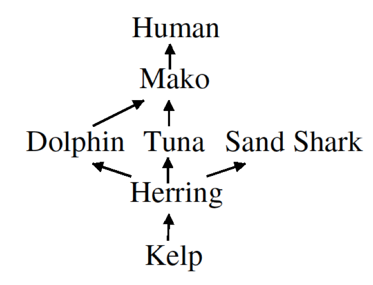

```{r setup, include=FALSE}
knitr::opts_chunk$set(echo = TRUE, progress = TRUE)
```

```{r packageload, message=FALSE}
library(here)
library(tidyverse)
library(ggplot2)
library(dplyr)
library(rjags)
library(tidybayes)
```

This notebook includes code for the food web problem. The problem involves the seven species in this foodweb:

{ width=50% }

The arrows here indicate "eaten-by" relationships --- for example, kelp is eaten by herring, which in turn is eaten by dolphins, tuna and sand-sharks. 

We're interested in reasoning problems such as "Mako carry a certain disease but Kelp does not. How likely is it that Tuna carry the same disease?"

## Hypothesis space

Each of the seven species either carries or does not carry the disease, which means that there are 2^7 = 128 possible states of the world. Our hypothesis space includes all of these possibilities.  We'll enumerate all 128 using 1 to indicate FALSE (ie doesn't have the disease) and 2 to indicate TRUE (has the disease).

```{r hypspace}
speciesnames <- c("kelp", "herring", "dolphin", "tuna", "sandshark", "mako", "human")

n <-  length(speciesnames)
hs <-  expand.grid(replicate(n, 1:2, simplify = FALSE))
colnames(hs) <- speciesnames
hs <- as_tibble(hs)
nH <- nrow(hs)

tail(hs)
```

## Prior distribution

Let's now set up the prior distribution over this hypothesis space. We're going to assume that each species has probability $b$ of having the disease for reasons unrelated to the foodweb. We'll also assume that if species $A$ carries the disease and if $A$ is eaten by species $B$, then the probability that $A$ transmits the disease to $B$ is $t$. 


```{r foodweb}
b <- 0.1 # base rate
t <- 0.5 # transmission rate

# set up noisy-OR CPDs

zerop <- c(1-b,b)
onep  <- structure(.Data = c(1-b,(1-t)*(1-b),b,1 - (1-t)*(1-b)), .Dim = c(2,2))
twop  <- structure(.Data = c( 1-b, 
                             (1-t)*(1-b), 
                             (1-t)*(1-b), 
                             (1-t)*(1-t)*(1-b), 
                              b, 
                              1-(1-t)*(1-b), 
                              1-(1-t)*(1-b), 
                              1-(1-t)*(1-t)*(1-b)),  .Dim = c(2,2,2))
cpds <- list( kelp=zerop, 
              herring=onep, 
              dolphin=onep,
              tuna=onep,
              sandshark=onep,
              mako=twop,
              human=onep )

# function that computes the probability of hypothesis H, which specifies a
# value for each species in the foodweb 

p_h <- function(h) {
  prob = cpds$kelp[h$kelp] *
    cpds$herring[h$kelp,h$herring] *
    cpds$dolphin[h$herring,h$dolphin] *
    cpds$tuna[h$herring,h$tuna] *
    cpds$sandshark[h$herring,h$sandshark] *
    cpds$mako[h$dolphin,h$tuna,h$mako] *
    cpds$human[h$mako,h$human] 

  return(prob)
}

hs$prior = NA

# set up prior 
for (i in 1:nH) {
  hs$prior[i] <- p_h(hs[i,])
}
tail(hs)
```

## Observed data

The observed data are the premises of the argument --- e.g. we might be told that kelp does not have the disease but makos do, and asked to decide how probable it is that the other species have the same disease

```{r data}
# Specify that kelp does not have the disease, but makos do
obs <- list(kelp = 1, mako = 2)
```

## Likelihood function

We need to specify the likelihood $P(\text{obs}|h)$ which captures how probable the observations would be if $h$ were true. Here we'll assume that the observations are generated by going out and measuring whether each species in `obs` has the disease, and that the measurements are perfect and error-free. This means that $P(\text{obs}|h)$ is 1 if hypothesis $h$ is consistent with the observations and 0 otherwise.

```{r likelihood}

# Compute likelihood p(obs|h) 
p_obs_given_h <- function(obs, h) {
  likelihood <- 1
  for (l in labels(obs)) {
    if (obs[l] != h[l]) {
      likelihood <-  0
    }
  }
  return(likelihood)
}

hs$likelihood= NA
for (i in 1:nH) {
  hs$likelihood[i] <- p_obs_given_h(obs, hs[i,])
}
tail(hs)
```

## Compute posterior 

Now we can combine the prior and likelihood to compute the posterior.

```{r posterior}
# compute posterior
hs$posterior <- hs$prior* hs$likelihood
# "normalise" the posterior so that it sums to 1
hs$posterior <- hs$posterior / sum( hs$posterior ) 
tail(hs)
```

## Predictions about other species

We can now use the posterior distribution to answer questions about other species in the foodweb -- e.g. how probable is it that Tuna carry the disease given what we've observed?


```{r predictions}
# compute posterior predictive distribution: ie generalizations for each species in the foodweb

gen <- hs[1,] %>% select(-likelihood, posterior)
for( animalname  in speciesnames ) {
    consistentHypotheses <- as.logical(hs[[animalname]]-1)
    gen[animalname] <- sum( hs$posterior[consistentHypotheses] ) 
}
print(gen)
```

Now plot the predictions.

```{r plotpredictions, fig.width=6,  fig.height=3}

makeplot <- function(gen, plotname) {
    genplot <- gather(gen)
    genplot <- genplot %>%
       mutate(species = factor(key, levels=speciesnames), gen=value) 

    pic <- genplot %>%
       ggplot(aes(x=species, y=value)) +
       scale_y_continuous(lim=c(0,1)) +  
       geom_col() + 
       theme(axis.text.x = element_text(angle = 90, hjust = 1, vjust = 0.5)) +
       xlab("species") +
       ylab("prob of having disease") 

    plot(pic)
}  

# plot generalizations across the food web 
makeplot(gen[1:n])
```

Given that mako have the disease but kelp do not, we see that humans are the species next most likely to have the disease.

## Exercises (A)

1.  The function `p_h()` computes  the prior probability of a hypothesis by multiplying 7 terms together. Make sure you understand what these seven terms are and why they are there. 

2.  Set the observation vector to an empty list: i.e. `obs <- list()`.  What generalizations do you now expect? Run the notebook again to see what happens. You should see that makos are more likely to have the disease than kelp ---  why? You should also see that humans are less likely to have the disease than makos--- why?

3.  Try playing around with the base rate and transmission rate parameters. Do the model's generalizations change as you might expect?

## Inference by sampling from the prior

If the foodweb were bigger -- e.g. if there were 30 species -- we'd no longer be able to carry out inference by enumerating the entire hypothesis space. An alternative is to carry out inference by sampling. In this section we'll make predictions by sampling from the prior. Later we'll see how RJags can be used to carry out inference by Gibbs sampling.

First we set up a function that samples a hypothesis from the prior $P(h)$:

```{r priorsampling_function, fig.width=6,  fig.height=3}
# Sample a hypothesis from the prior

sample_h <- function() {
  tfvals <- c(1,2)
  h <- list()
  h$kelp <- sample(tfvals, 1, prob=cpds$kelp)
  h$herring <- sample(tfvals, 1, prob=cpds$herring[h$kelp,])
  h$dolphin <- sample(tfvals, 1, prob=cpds$dolphin[h$herring,])
  h$tuna <- sample(tfvals, 1, prob=cpds$tuna[h$herring,])
  h$sandshark <- sample(tfvals, 1, prob=cpds$sandshark[h$herring,])
  h$mako <- sample(tfvals, 1, prob=cpds$mako[h$dolphin,h$tuna,])
  h$human <- sample(tfvals, 1, prob=cpds$human[h$mako,])

  return(h)
}
```

Now use this function to draw 1000 samples from the prior.

```{r sample_from_prior}
nsample <- 1000
samples <- data.frame((matrix(NA, nrow = nsample, ncol = n)))
colnames(samples) <- speciesnames
samples <- as.tibble(samples)
for (i in 1:nsample) {
  samples[i,] <- sample_h()
}
```

Now use these samples to make predictions about which species carry the disease given the observations in `obs`:

```{r predict_given_samples }
samples$consistent <- NA

# compute whether each sample is consistent with the observations
for (i in 1:nsample) {
  samples$consistent[i] <- p_obs_given_h(obs, samples[i,])
}

consistentHypotheses <- as.logical(samples$consistent)
consistentsamples <- samples[consistentHypotheses,1:n]
gen <- samples[1,]
for( animalname  in speciesnames ) {
    # for each species compute the proportion of consistent samples for which
    # it takes value TRUE
    gen[animalname] <- mean( consistentsamples[[animalname]] ) - 1
    # NB: we need to subtract 1 from the mean because we're using 1 and 2 for TRUE and FALSE instead of 0 and 1
}

makeplot(gen[1:n])
```

## Exercises (B)

1. The function `sample h()` samples a hypothesis $h$ from the prior $P(h)$. First the value for kelp is sampled, then herring, and so on. Why do the values need to be sampled in this order?

2.  After sampling 1000 samples the code only uses those that are consistent with the observation vector. Why?

3.  Set the observation vector to `obs <- list(kelp = 1, mako = 2)` and run the script. Compare the output to what you saw when you computed the same set of predictions using enumeration as the inference method.

## Inference by Gibbs sampling using RJags

Let's now use a program called JAGS to sample directly from the posterior $P(h|\text{obs})$. 

The code here relies on a file called `foodweb.bug` that specifies the prior distribution on all variables in the model. 


```{r jags, eval=TRUE,  fig.width=6, fig.height=3}
foodwebdata<- c(obs, list(
      p.kelp = zerop,
      p.herring = onep,
      p.dolphin = onep,
      p.tuna = onep,
      p.sandshark = onep,
      p.mako = twop,
      p.human = onep))

# set up the model in JAGS
jags <- jags.model('foodweb.bug', data = foodwebdata,
                   n.chains = 4,
                   n.adapt = 100)

# actually run the model in JAGS (ie sample from the posterior P(h|obs) )
samples <- coda.samples(jags,
             c('kelp', 'herring', 'dolphin', 'tuna', 'sandshark', 'mako', 'human'),
             10000)

# for each species extract the proportion of samples for which it is TRUE. For today's session don't worry about the details of this function.

genplot <- samples %>%
        gather_draws(kelp, herring, dolphin, tuna, sandshark, mako, human) %>%
        rename(species=.variable, gen=.value) %>%
        ungroup() %>%
        select(species, gen) %>%
        mutate(species= factor(species, levels=speciesnames)) %>%
        group_by(species) %>%
        summarize(gen=mean(gen)-1)

makeplot(spread(genplot, species, gen))
```

## Exercises (C)

1. Take a look at  `foodweb.bug` and see if you can understand how this file specifies a distribution over all 7 variables in the model (ie all 7 species in the foodweb).

2.  Set the observation vector to
`obs <- list(kelp = 1, mako = 2)` and run the `jags` chunk to carry out inference. Compare the output to what you saw when you carried out inference by enumerating the hypothesis space.

